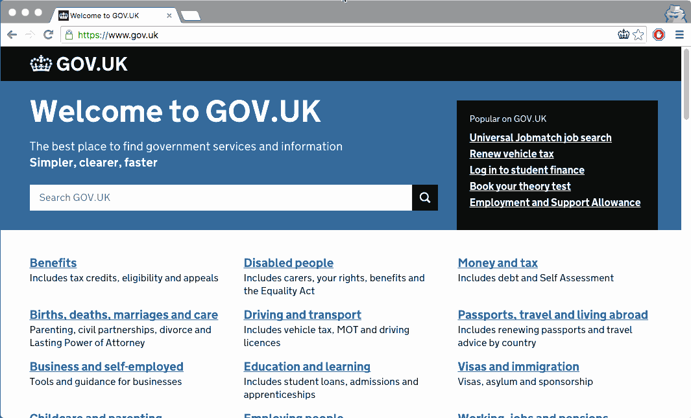

## GOV.UK Toolkit for Chrome and Firefox

Allows easy switching between the different GOV.UK environments and content representations. Inspired by the [govuk-bookmarklets](https://github.com/dsingleton/govuk-bookmarklets).



### Installation

The extension is [downloadable on the Chrome web store](https://chrome.google.com/webstore/detail/govuk-toolkit/dclfaikcemljbaoagjnedmlppnbiljen) and [AMO for Firefox](https://addons.mozilla.org/en-GB/firefox/addon/govuk-toolkit/).

If you don't want to install from your browser's web store for security reasons, you can install a local non-self updating copy.

#### For Chrome:

1. [Download the source from GitHub](https://github.com/alphagov/govuk-toolkit-chrome/archive/master.zip) and unzip.
2. Visit [chrome://extensions](chrome://extensions) in your browser.
3. Ensure that the Developer mode checkbox in the top right-hand corner is checked.
4. Click `Load unpacked extension…` to pop up a file selection dialog.
5. Navigate to `src` in the extension directory, and select it.
6. Visit any page on [GOV.UK](https://www.gov.uk).

Source: [Getting Started: Building a Chrome Extension](https://developer.chrome.com/extensions/getstarted#unpacked).

#### For Firefox:

Extensions installed using the following instructions are only active while Firefox
is open and are removed on exit. Permanently-active extensions can be only be
installed from packages signed by Mozilla.

1. [Download the source from GitHub](https://github.com/alphagov/govuk-toolkit-chrome/archive/master.zip) and unzip.
2. Visit [about:debugging](about:debugging) in your browser.
4. Click `Load Temporary Add-on` to pop up a file selection dialog.
5. Navigate to `src` in the extension directory, and select `manifest.json`.
6. Visit any page on [GOV.UK](https://www.gov.uk).

Source: [Temporary installation in Firefox](https://developer.mozilla.org/en-US/Add-ons/WebExtensions/Temporary_Installation_in_Firefox).

### Running the tests

In development, it's easiest to run:

```
$ bundle exec rake jasmine
```

This will start a server on http://localhost:8888/ that serves the tests.

You can also run the Jasmine test suite in slower "headless" mode with:

```
$ bundle exec rake jasmine:ci
```

### Releasing the extension

1. Update the version in `manifest.json`
2. Run `rake build`
3. Upload newly created package in `/build` to the [Chrome web store](https://chrome.google.com/webstore/developer/edit/dclfaikcemljbaoagjnedmlppnbiljen) (currently on [Tijmen's](https://github.com/tijmenb) account) and [AMO](https://addons.mozilla.org/en-US/developers/addon/da5cfa61532d478ea212/versions/submit/) (account details in the [2nd line password store](https://github.com/alphagov/govuk-secrets/tree/master/pass/2ndline/firefox)).
4. Create a [new release on GitHub](https://github.com/alphagov/govuk-toolkit-chrome/releases/new)

### License

MIT License
